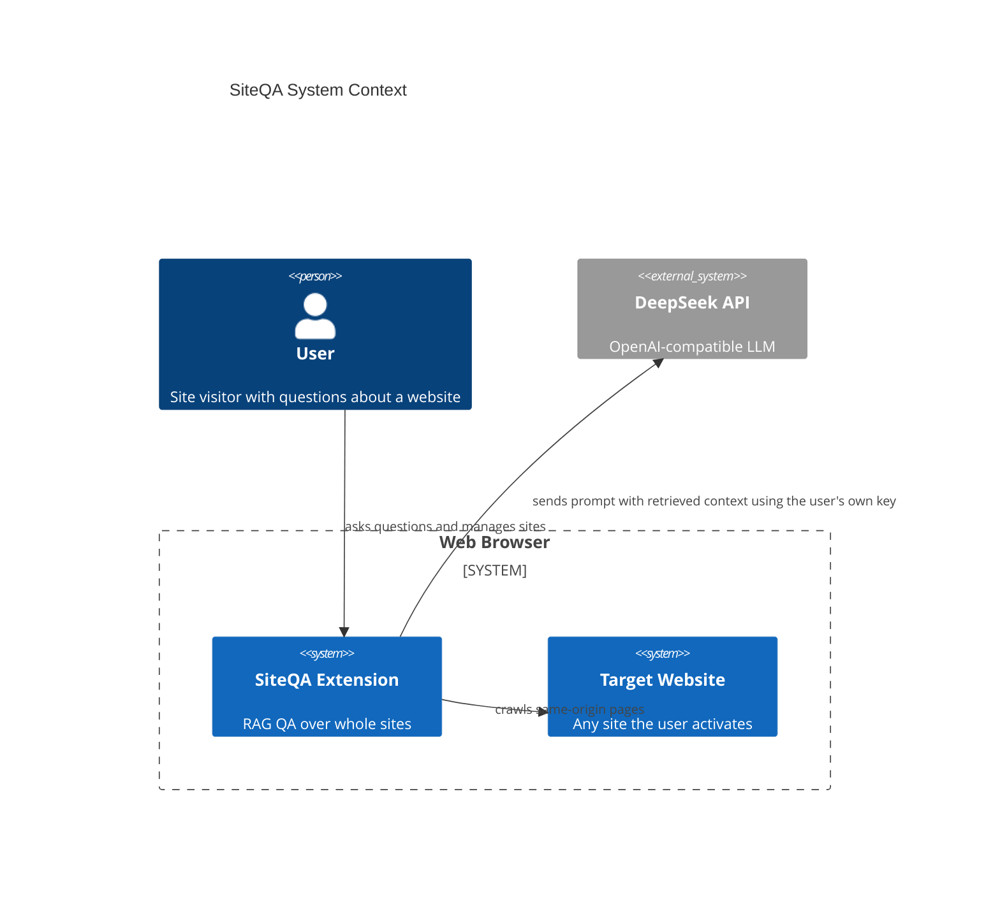
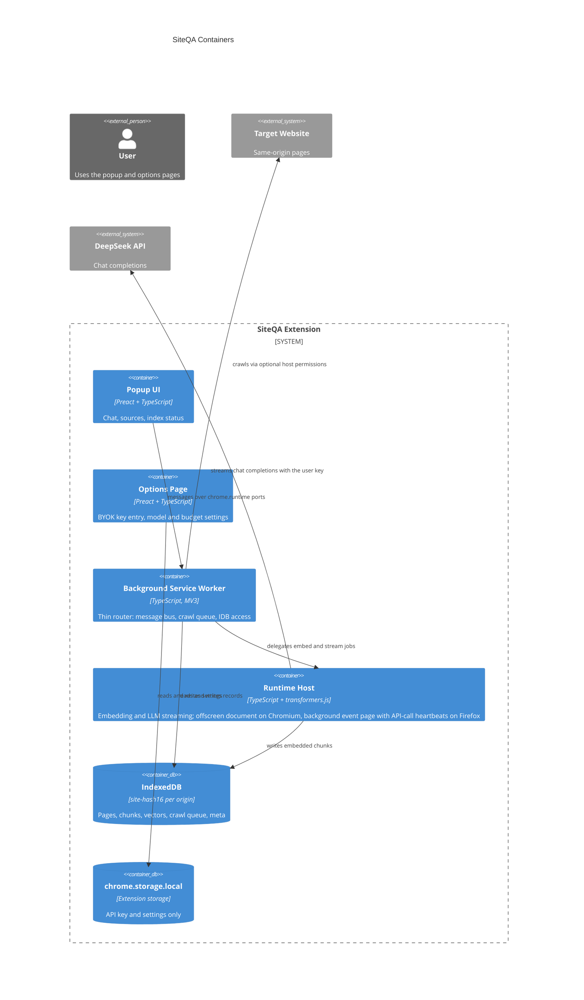
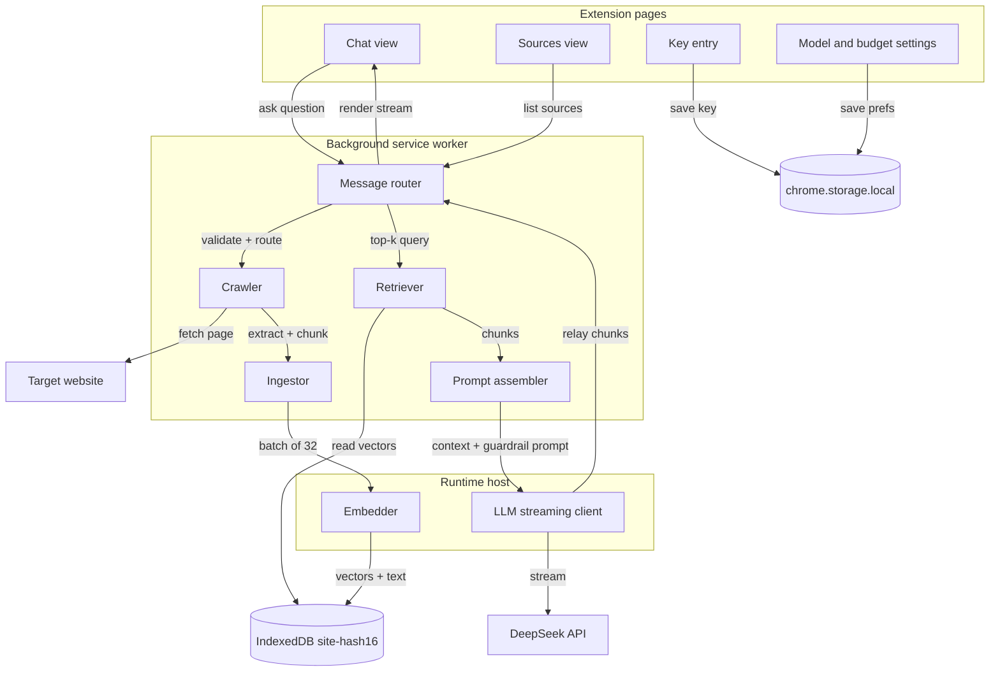

# 02 — Architecture

## System context

The extension is the entire system. The only external dependency is DeepSeek, called directly from the browser with the user's own key (BYOK). No data flows through any server the project operates.

## Containers

Two platform facts shape this split (ADR-0001, ADR-0008):

- A plain in-flight `fetch` does not keep the MV3 service worker alive; it is killed after ~30s idle and a streaming LLM response can exceed that. Both embedding inference and LLM streaming therefore live in a runtime host — an offscreen document on Chromium, the background event page itself on Firefox, kept alive by the extension-API calls the job makes anyway (ADR-0001) — with streamed chunks relayed to the popup over ports. Each relayed message resets idle timers (Chrome 114+).
- Closing the popup kills popup-initiated fetches. Nothing the user's answer depends on may run in the popup itself.

The service worker stays a thin router: it owns the message bus, the crawl queue, and IndexedDB access, and delegates CPU-heavy or long-lived work to the offscreen document.

## Components

### Module responsibilities

| Module | Context | Responsibility |
|---|---|---|
| Message router | SW | Validates sender and schema of every message; dispatches to modules; owns popup ports |
| Crawler | SW | Queue, fetch, robots.txt and sitemap.xml, dedup, politeness, resume (03) |
| Ingestor | SW | Readability extraction, heading-aware chunking, content hashing |
| Embedder | Runtime host | transformers.js inference, WebGPU with WASM fallback, batched, checkpointed |
| Retriever | SW | Cosine similarity over per-origin vectors, top-k, context budget trimming |
| Prompt assembler | SW | Instruction-hierarchy prompt; delimited untrusted documents (04) |
| LLM streaming client | Runtime host | DeepSeek SSE streaming, retries, error mapping, token accounting (06) |
| Popup UI | Popup | Chat with citations, index status, sources list |
| Options page | Options | Key entry, model picker, thinking toggle, budget and caps |

## Design principles

1. **The browser is the server.** No backend exists by design; every server capability is reimplemented with browser storage and execution contexts.
2. **The key belongs to its owner.** BYOK throughout; key material never leaves `chrome.storage.local` and the offscreen fetch scope (ADR-0006, 04).
3. **Untrusted by default.** Crawled page content is treated as hostile input at every stage: sanitized at extraction, bounded at chunking, and fenced at prompting (04).
4. **Free first.** Every component is open source and runs locally; the only spend is the user's own DeepSeek usage, metered and capped (06).
5. **Kill-safe by construction.** Every long job is resumable: crawl queue persists, embedding batches checkpoint, streams re-establishable (03).
6. **Per-origin isolation.** Indexes, quotas, and permissions are scoped per origin; a site can only ever poison or waste its own index (04, 05).

## Technology stack

| Concern | Choice | Rationale |
|---|---|---|
| Language | TypeScript strict | Shared types across all four extension contexts |
| Build | Vite + @crxjs/vite-plugin (M1) | MV3-aware bundling, HMR |
| UI | Preact + signals | Popup-sized UI without a framework tax (ADR-0007) |
| HTML extraction | @mozilla/readability | Battle-tested boilerplate removal |
| Embeddings | transformers.js v3, onnx-community/bge-small-en-v1.5 Q8 (~34MB, 384-dim, CLS pooling); MiniLM-L6-v2 Q8 (~23MB) as fallback | Free, local, bundled in the package (ADR-0002) |
| Vector store | Hand-rolled IndexedDB + Float32Array cosine | ~10ms brute force at 10k chunks; no dependency worth its weight (ADR-0003) |
| Markdown rendering | marked + DOMPurify | Output is data, never markup that can execute |
| Tests | vitest | Fast, same-idiom as build |

## Key decisions

| Decision | ADR |
|---|---|
| Runtime host: offscreen document on Chromium, background event page with API-call heartbeats on Firefox | [ADR-0001](adr/0001-runtime-host-execution.md) |
| Model bundled in the package, not CDN-loaded | [ADR-0002](adr/0002-bundled-model-vs-cdn.md) |
| Brute-force cosine now, HNSW later | [ADR-0003](adr/0003-brute-force-vs-hnsw.md) |
| Readability plus custom heading-aware splitter | [ADR-0004](adr/0004-readability-custom-splitter.md) |
| Per-origin IndexedDB databases | [ADR-0005](adr/0005-per-origin-idb.md) |
| BYOK key in storage.local, never synced | [ADR-0006](adr/0006-byok-storage.md) |
| Preact for extension pages | [ADR-0007](adr/0007-preact.md) |
| Streaming path through offscreen + ports | [ADR-0008](adr/0008-streaming-path.md) |
| One codebase, two build targets, namespace shim | [ADR-0009](adr/0009-cross-browser-packaging.md) |
