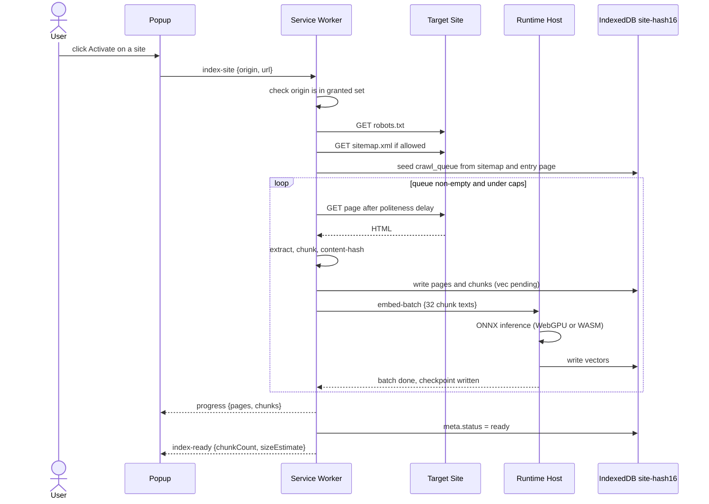
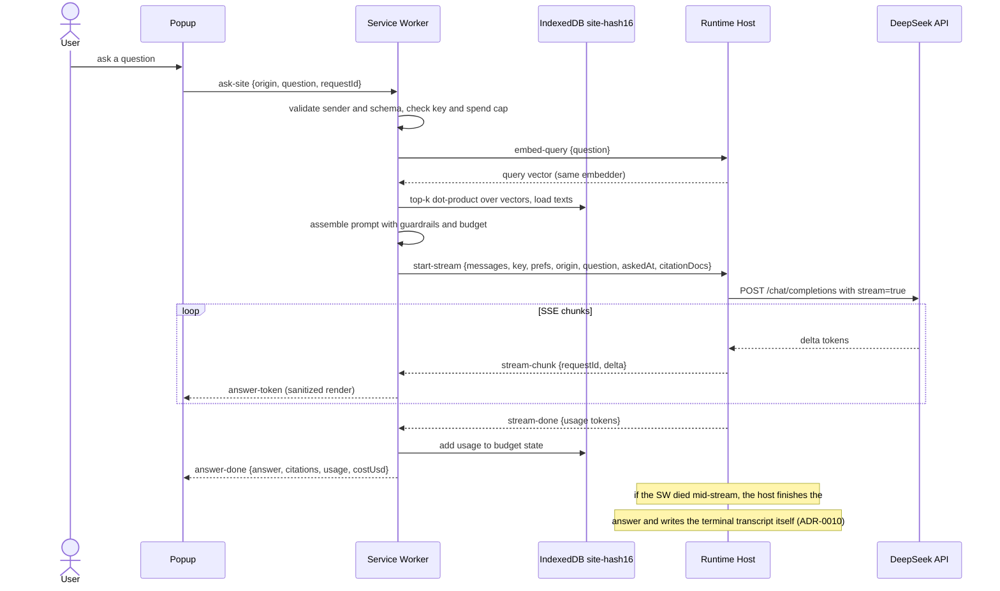
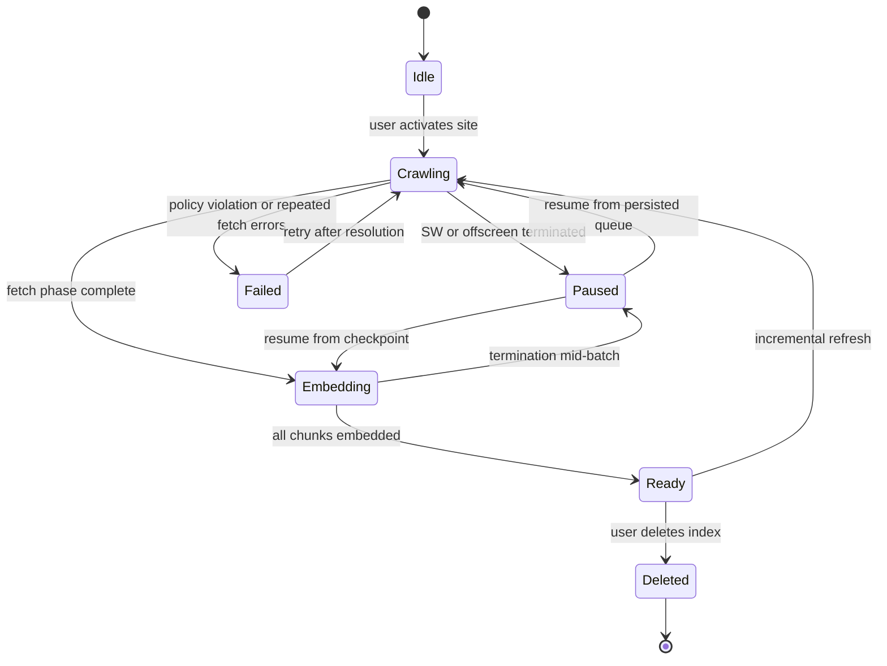

# 03 — Component Design

## Indexing flow

## QA flow

## Crawl job state machine

Jobs survive kills because both the crawl queue and embedding checkpoints are persisted in IndexedDB before any work is acknowledged. A kill costs at most one un-checkpointed batch (32 chunks).

## Message bus and protocol

All communication between contexts goes through a validated message bus in the service worker. There is no `externally_connectable` (04). One-shot requests use `runtime.sendMessage`; two continuous channels use named runtime ports with the same sender gate (`isTrustedPort`): `siteqa-progress` (popup subscribes per origin, SW broadcasts `index-progress` / `index-ready` / `index-failed` / `answer-*` events, filtered by origin and correlated on `requestId`) and `siteqa-host` (SW -> runtime host embed batches and QA streams, correlated on `batchId` / `requestId`).

| Message | Direction | Payload | Status |
|---|---|---|---|
| `get-settings` | options/popup -> SW | — | M1 |
| `save-settings` | options -> SW | `{settings}` (sanitized server-side; `apiKey` and spend never accepted) | M1 |
| `get-site-status` | popup -> SW | `{origin}` | M1 |
| `index-site` | popup -> SW | `{origin, url}` (url re-derived and same-origin-checked, 04) | M2 |
| `index-progress` | SW -> popup | `{origin, phase, pages, chunks, totalChunks}` | M2 |
| `index-ready` | SW -> popup | `{origin, chunkCount, sizeEstimateBytes}` | M2 |
| `index-failed` | SW -> popup | `{origin, reason}` | M2 |
| `list-sources` | popup -> SW | `{origin}` | M2 |
| `ask-site` | popup -> SW | `{origin, question, requestId}` | M3 |
| `get-qa-stream` | popup -> SW | `{origin, requestId}`; asks whether a live stream can still produce a terminal state | M4 |
| `start-stream` | SW -> runtime host | `{requestId, messages, key, prefs, origin, question, askedAt, citationDocs}` — the session context the host needs for its takeover transcript (ADR-0010) | M3 |
| `stream-chunk` | runtime host -> SW | `{requestId, delta}` | M3 |
| `stream-retry` | runtime host -> SW | `{requestId}` (backoff retry before any content, 06) | M3 |
| `stream-done` | runtime host -> SW | `{requestId, usage}` (null when the provider omits usage) | M3 |
| `stream-error` | runtime host -> SW | `{requestId, error}` (mapped per the 06 matrix) | M3 |
| `stream-status` | SW -> runtime host | `{requestId}`; raw-port liveness query, never creates or closes the offscreen document | M4 |
| `stream-status-reply` | runtime host -> SW | `{requestId, active}` | M4 |
| `answer-token` | SW -> popup | `{requestId, origin, delta}` | M3 |
| `answer-retry` | SW -> popup | `{requestId, origin}` | M3 |
| `answer-done` | SW -> popup | `{requestId, origin, answer, citations, usage, costUsd, spentThisMonthUsd}` | M3 |
| `answer-error` | SW -> popup | `{requestId, origin, reason, message}` | M3 |
| `embed-query` | SW -> runtime host | `{batchId, texts}` (query embedding, 1-8 texts) | M3 |
| `embed-query-done` | runtime host -> SW | `{batchId, vecs}` | M3 |
| `embed-query-error` | runtime host -> SW | `{batchId, error}` | M3 |
| `embed-batch` | SW -> runtime host | `{dbName, batchId, chunks}` | M2 |
| `embed-done` | runtime host -> SW | `{dbName, batchId, embedded}` | M2 |
| `embed-error` | runtime host -> SW | `{dbName, batchId, error}` | M2 |

Validation rules, applied in order for every incoming message:

1. `sender.id === chrome.runtime.id` for every sender.
2. Schema validation: type discriminant plus shape check before dispatch; unknown or malformed messages are dropped.
3. Origin checks: crawl and query targets are always re-derived server-side from the granted set; page-supplied URLs are never used as crawl targets. Origin strings must be canonical http(s) origins with no path, credentials, or explicit port — permission match patterns cannot carry ports.

## Crawler (service worker)

- **Seeding.** Entry URL is the current tab URL (passed by popup, re-validated). robots.txt fetched first; sitemap.xml and sitemap index entries are enqueued at depth 0 when allowed. Link discovery from page HTML feeds deeper queue levels up to `maxDepth`.
- **Same-origin enforcement.** Every candidate URL is parsed and compared against the site origin before enqueue; the queue is re-validated on dequeue as well (defense in depth).
- **Politeness.** Delay between fetches clamped to 250-1000ms (`clampPoliteness`); `robots.txt` crawl-delay honored when present.
- **Dedup.** URLs normalized (fragment stripped, trailing-slash canonicalized); SHA-256 content hash of extracted text skips re-embedding of unchanged pages on refresh (ETag short-circuits the fetch entirely when the server supports it).
- **Caps.** `maxPages` (1000) and `maxDepth` (6) stop runaway crawls; the queue is bounded.
- **Resume.** The queue and `meta.status` live in IndexedDB; on SW restart, any `fetching`/`queued` items are re-enqueued with attempt counters. Items failing after 3 attempts are marked `failed` and reported in the sources view.

## Ingestor (service worker)

1. `Readability` extracts the article: title, headings, main text; scripts, navigation, ads, and boilerplate removed before chunking.
2. The chunker walks the DOM-level heading outline (h1-h6) and splits text at heading boundaries first, then by the model's own tokenizer to `chunkTokens` (512) with `chunkOverlapTokens` (64) overlap. Each chunk records its nearest heading path for citations.
3. Content hash is computed over extracted text only, so template changes do not force re-embedding.

## Embedder (runtime host)

- transformers.js 4.3.0 loads the bundled `Xenova/bge-small-en-v1.5` Q8 model (~34MB, 384-dim). WebGPU used when `navigator.gpu` exists (Chrome 113+); otherwise single-threaded WASM.
- Batches of 32 chunk texts; each batch is embedded, written to IndexedDB, then check pointed before the next batch starts.
- Runtime host lifecycle (ADR-0001): on Chromium, created on demand with reason `WORKERS` after a `chrome.offscreen.hasDocument()` check (only one offscreen document may exist), retained while a port to the SW is open, closed when idle. On Firefox, the host is the background event page itself; every batch checkpoint and progress write is a parent extension-API call that resets the idle timer (Bug 1844041).

## Vector store (IndexedDB)

- One database per origin: `site-` + first 16 hex chars of SHA-256(origin) (`siteDbName`). Deleting a site closes and deletes one database.
- Stores: `pages` (keyed by urlHash), `chunks` (keyed by chunkId, index on urlHash), `crawl_queue` (keyed by url), `meta` (keyed by origin).
- Search: load all vectors for the origin, dot-product against the query vector, keep top-k, then pack by context budget. The M3 benchmark (10k chunks, fake-indexeddb in Node — conservative versus native IDB) measured p99 253ms / mean 210ms end-to-end per query, under the p95 < 500ms gate (bench: `npm run bench:retrieval`). The HNSW upgrade path exists past ~50k chunks (ADR-0003).

## Retriever and prompt assembler (service worker)

- Query is embedded via an `embed-query` frame on the host port (same embedder, one pass; 120s host timeout).
- Top-k chunks are ordered by similarity and packed into the `<documents>` block while the token estimate stays under `contextTokenBudget` (8000); each chunk is prefixed with `[n] title | url | heading`. The last packed chunk is truncated by character ratio to respect the budget exactly; indices `[1..n]` are assigned after selection, and chunks without vectors (pending embedding) or without a page record are skipped.
- The prompt template and its guardrails are specified in [04 — Security](04-security-threat-model.md#prompt-injection-defense).

## LLM streaming client (runtime host)

- Receives `{messages, key, prefs, origin, question, askedAt, citationDocs}` from the SW, POSTs to `https://api.deepseek.com/chat/completions` with `stream: true`, and relays SSE deltas back to the SW over the port (`stream-chunk` / `stream-retry` / `stream-done` / `stream-error`). Each relayed chunk resets MV3 idle timers.
- **Takeover (ADR-0010):** if the SW port dies mid-stream, the host finishes the answer and writes the terminal transcript to `storage.session` itself — citations validated from `citationDocs`, spend accounted with the same budget write the SW uses. A completed answer is never lost to a re-ask.
- Retries happen only before any content has streamed — a partially streamed answer is never re-sent (duplicate billing). The API key lives only in the fetch headers of the current request; it is never stored in host state.
- Error mapping, retries, and token accounting are specified in [06 — LLM Integration](06-llm-integration.md).

## Popup UI

States: `inactive` (site not granted), `indexing` (progress bar, page and chunk counts), `ready` (QA chat, sources list, storage readout), `error` (banner with actionable message). On open, the popup reads the active tab's URL via `activeTab` (no `tabs` permission, 07) and asks the SW for the site status; the grant button requests the per-site optional host permission. M1 reaches `inactive`/`idle`; the remaining states arrive with M2/M3. The QA area is a question box plus Ask (Enter submits; disabled while an answer is in flight). Answer deltas stream in, correlated on `requestId`, and render as sanitized markdown with `[n]` citation chips that expand to source URL and heading. Mapped errors (401/402/429/5xx, 06) show as dismissible banners; key and spend errors link straight to options. A spend footer shows the last answer's tokens and cost plus month-to-date spend against the cap. Closing the popup mid-answer loses nothing: the transcript is buffered to `storage.session` per origin (05) and restored on reopen, mid-stream or complete. Every `asking` phase runs a watchdog (ADR-0010): it applies the terminal transcript whenever it lands (from the SW or the host's takeover write) and, once no live stream can produce one, shows "This answer was interrupted. Ask again." and re-enables the input — a restored dead stream never dead-ends at "Answering...". Only the popup renders model output; nothing it renders can execute (marked + DOMPurify, 04).

## Options page

Sections: API key (masked input, test button, last-4 display, replace/delete), model (ID picker: `deepseek-v4-flash` / `deepseek-v4-pro` / custom, thinking toggle, temperature, max output tokens), budget (monthly limit, per-1M price inputs, spent readout), crawl caps. All values flow through the message bus to `chrome.storage.local`; the key is never sent to any other context (06).
