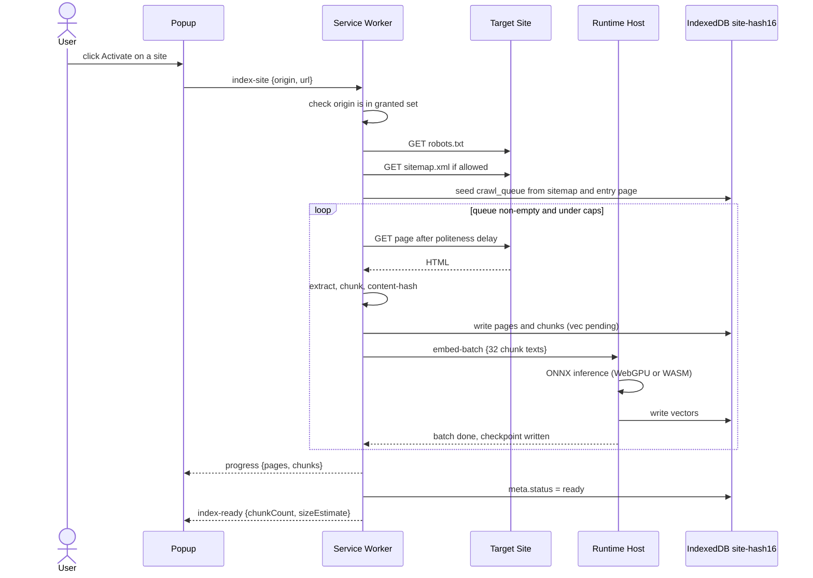
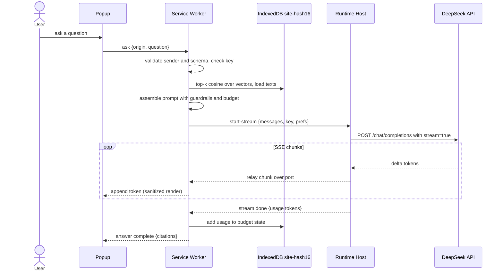
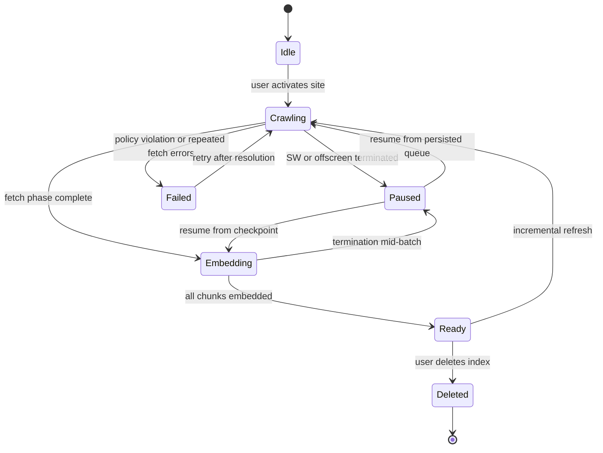

# 03 — Component Design

## Indexing flow

## QA flow

## Crawl job state machine

Jobs survive kills because both the crawl queue and embedding checkpoints are persisted in IndexedDB before any work is acknowledged. A kill costs at most one un-checkpointed batch (32 chunks).

## Message bus and protocol

All communication between contexts goes through a validated message bus in the service worker. There is no `externally_connectable` (04). One-shot requests use `runtime.sendMessage`; two continuous channels use named runtime ports with the same sender gate (`isTrustedPort`): `siteqa-progress` (popup subscribes per origin, SW broadcasts `index-progress` / `index-ready` / `index-failed`) and `siteqa-host` (SW -> runtime host batches, correlated on `batchId`).

| Message | Direction | Payload | Status |
|---|---|---|---|
| `get-settings` | options/popup -> SW | — | M1 |
| `save-settings` | options -> SW | `{settings}` (sanitized server-side; `apiKey` and spend never accepted) | M1 |
| `get-site-status` | popup -> SW | `{origin}` | M1 |
| `index-site` | popup -> SW | `{origin, url}` (url re-derived and same-origin-checked, 04) | M2 |
| `index-progress` | SW -> popup | `{origin, phase, pages, chunks, totalChunks}` | M2 |
| `index-ready` | SW -> popup | `{origin, chunkCount, sizeEstimateBytes}` | M2 |
| `index-failed` | SW -> popup | `{origin, reason}` | M2 |
| `list-sources` | popup -> SW | `{origin}` | M2 |
| `ask` | popup -> SW | `{origin, question, requestId}` | M3 |
| `stream-chunk` | runtime host -> SW | `{requestId, delta}` | M3 |
| `stream-done` | runtime host -> SW | `{requestId, usage}` | M3 |
| `answer-token` / `answer-done` | SW -> popup | `{requestId, delta or citations}` | M3 |
| `embed-batch` | SW -> runtime host | `{dbName, batchId, chunks}` | M2 |
| `embed-done` | runtime host -> SW | `{dbName, batchId, embedded}` | M2 |
| `embed-error` | runtime host -> SW | `{dbName, batchId, error}` | M2 |

Validation rules, applied in order for every incoming message:

1. `sender.id === chrome.runtime.id` for every sender.
2. Schema validation: type discriminant plus shape check before dispatch; unknown or malformed messages are dropped.
3. Origin checks: crawl and query targets are always re-derived server-side from the granted set; page-supplied URLs are never used as crawl targets. Origin strings must be canonical http(s) origins with no path, credentials, or explicit port — permission match patterns cannot carry ports.

## Crawler (service worker)

- **Seeding.** Entry URL is the current tab URL (passed by popup, re-validated). robots.txt fetched first; sitemap.xml and sitemap index entries are enqueued at depth 0 when allowed. Link discovery from page HTML feeds deeper queue levels up to `maxDepth`.
- **Same-origin enforcement.** Every candidate URL is parsed and compared against the site origin before enqueue; the queue is re-validated on dequeue as well (defense in depth).
- **Politeness.** Delay between fetches clamped to 250-1000ms (`clampPoliteness`); `robots.txt` crawl-delay honored when present.
- **Dedup.** URLs normalized (fragment stripped, trailing-slash canonicalized); SHA-256 content hash of extracted text skips re-embedding of unchanged pages on refresh (ETag short-circuits the fetch entirely when the server supports it).
- **Caps.** `maxPages` (1000) and `maxDepth` (6) stop runaway crawls; the queue is bounded.
- **Resume.** The queue and `meta.status` live in IndexedDB; on SW restart, any `fetching`/`queued` items are re-enqueued with attempt counters. Items failing after 3 attempts are marked `failed` and reported in the sources view.

## Ingestor (service worker)

1. `Readability` extracts the article: title, headings, main text; scripts, navigation, ads, and boilerplate removed before chunking.
2. The chunker walks the DOM-level heading outline (h1-h6) and splits text at heading boundaries first, then by the model's own tokenizer to `chunkTokens` (512) with `chunkOverlapTokens` (64) overlap. Each chunk records its nearest heading path for citations.
3. Content hash is computed over extracted text only, so template changes do not force re-embedding.

## Embedder (runtime host)

- transformers.js v3 loads the bundled `onnx-community/bge-small-en-v1.5` Q8 model (~34MB, 384-dim). WebGPU used when `navigator.gpu` exists (Chrome 113+); otherwise single-threaded WASM.
- Batches of 32 chunk texts; each batch is embedded, written to IndexedDB, then check pointed before the next batch starts.
- Runtime host lifecycle (ADR-0001): on Chromium, created on demand with reason `WORKERS` after a `chrome.offscreen.hasDocument()` check (only one offscreen document may exist), retained while a port to the SW is open, closed when idle. On Firefox, the host is the background event page itself; every batch checkpoint and progress write is a parent extension-API call that resets the idle timer (Bug 1844041).

## Vector store (IndexedDB)

- One database per origin: `site-` + first 16 hex chars of SHA-256(origin) (`siteDbName`). Deleting a site closes and deletes one database.
- Stores: `pages` (keyed by urlHash), `chunks` (keyed by chunkId, index on urlHash), `crawl_queue` (keyed by url), `meta` (keyed by origin).
- Search: load all vectors for the origin, normalize, dot-product against the query vector, keep top-k. At 10k chunks x 384-dim this is ~10ms in JS. The HNSW upgrade path exists past ~50k chunks (ADR-0003).

## Retriever and prompt assembler (service worker)

- Query is embedded via the offscreen embedder (same model, one pass).
- Top-k chunks are ordered by similarity and packed into the `<documents>` block while the token estimate stays under `contextTokenBudget` (8000); each chunk is prefixed with `[n] title | url | heading`.
- The prompt template and its guardrails are specified in [04 — Security](04-security-threat-model.md#prompt-injection-defense).

## LLM streaming client (runtime host)

- Receives `{messages, key, prefs}` from the SW, POSTs to `https://api.deepseek.com/chat/completions` with `stream: true`, and relays SSE deltas back to the SW over the port. Each relayed chunk resets MV3 idle timers.
- Error mapping, retries, and token accounting are specified in [06 — LLM Integration](06-llm-integration.md).

## Popup UI

States: `inactive` (site not granted), `indexing` (progress bar, page and chunk counts), `ready` (chat box, sources list, storage readout), `error` (banner with actionable message). On open, the popup reads the active tab's URL via `activeTab` (no `tabs` permission, 07) and asks the SW for the site status; the grant button requests the per-site optional host permission. M1 reaches `inactive`/`idle`; the remaining states arrive with M2/M3. The chat renders assistant output as sanitized markdown with `[n]` citation chips that expand to source URL and heading. Only the popup renders model output; nothing it renders can execute (marked + DOMPurify, 04).

## Options page

Sections: API key (masked input, test button, last-4 display, replace/delete), model (ID picker: `deepseek-v4-flash` / `deepseek-v4-pro` / custom, thinking toggle, temperature, max output tokens), budget (monthly limit, per-1M price inputs, spent readout), crawl caps. All values flow through the message bus to `chrome.storage.local`; the key is never sent to any other context (06).
